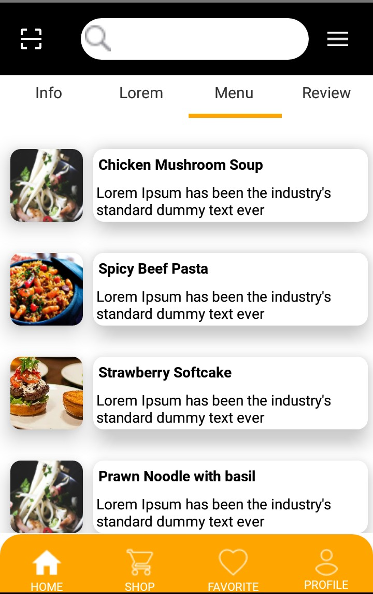
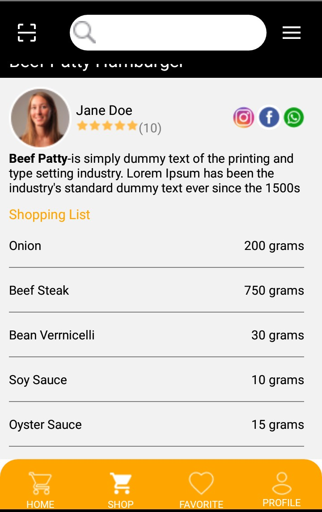

<h1 align="center">TEST TECHNICAL REACT NATIVE</h1>

## Introduction

This apk is used for the recruitment test on Hampton Solution with the participant name Handika Yulma Kristiawan

## Requirements

- [`npm`](https://www.npmjs.com/get-npm)
- [`react-native`](https://facebook.github.io/react-native/docs/getting-started)

## Usage for development

1. Open your terminal or command prompt
2. Type `git clone https://github.com/handika97/Mockup_Test_Tecknical.git`
3. Open the folder and type `npm install` for install dependencies and `react-native link`
4. Before run this, you must run backend first
5. Type `react-native run-android` for run this app. **_Make sure your device is connected with debugging mode_**.

## Screenshots

       
       
       
       
       
    

## Release APK

